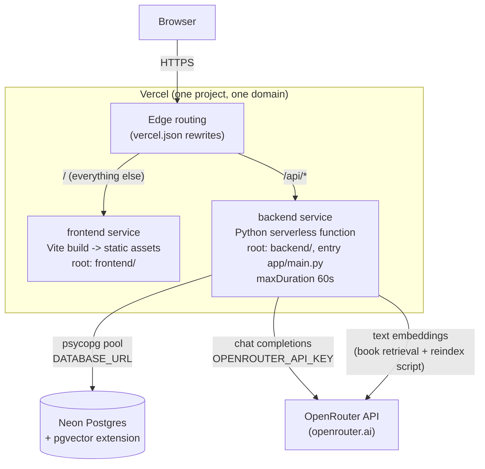
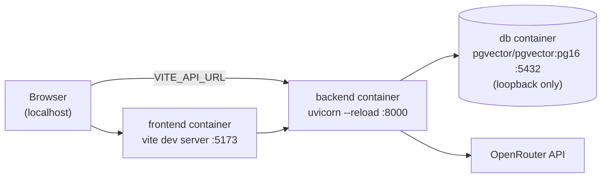

# itm-tutor

Adaptive tutoring prototype: a deterministic rules/planner control layer in
front of an LLM tutor, with a book-grounded RAG layer over one course
textbook. See [claude.md](claude.md) for the full spec, [backend/README.md](backend/README.md)
for backend setup, and [frontend/README.md](frontend/README.md) for frontend setup.

The backend is a stateless FastAPI app by design (see [vercel.json](vercel.json)
and [backend/vercel.json](backend/vercel.json)). It does no local disk writes
at request time and keeps no in-process cache that must survive between
requests, so it runs the same way on a serverless function or a long-lived
container.

## Production deployment

One Vercel project, defined by the root [vercel.json](vercel.json), builds and
routes two services on a single domain:



| Piece | Runs where | Notes |
|---|---|---|
| Frontend | Vercel, static hosting | [im-tutor-smoky.vercel.app](https://im-tutor-smoky.vercel.app/). Built from `frontend/` with Vite (`npm run build` produces `dist/`). No server-side code. |
| Backend API | Vercel, Python serverless function | [backend-red-eight-q9sab1t0oo.vercel.app](https://backend-red-eight-q9sab1t0oo.vercel.app/). `backend/`, entry point `app/main.py`. Vercel's Python runtime installs from `requirements.txt` (regenerated from `pyproject.toml`/`uv.lock`, see [backend/README.md](backend/README.md)), not `uv sync` directly. |
| Database | Neon, managed Postgres external to Vercel | Host: `ep-squar-bonus-axiy6u3k-pooler.c-4.us-east-2.aws.neon.tech`. Stores everything the app needs to persist: users, conversations/messages, attachments (as `BYTEA`), lesson plans, turn logs, rate-limit counters, and the book's embedded chunks (`book_chunks`, via the `pgvector` extension). Reached over `DATABASE_URL`. |
| LLM + embeddings | OpenRouter, external API | One API key (`OPENROUTER_API_KEY`) covers both chat completions (`app/llm/client.py`, model via `OPENROUTER_MODEL`) and text embeddings (`app/rag/embeddings.py`, model via `OPENROUTER_EMBEDDING_MODEL`). No local ML models, so nothing torch-sized ships in the function. |
| Course PDF + extracted figures | Bundled into the backend deployment | `backend/Krcmar2015_Informationsmanagement.pdf` and the images under `backend/data/book_images/` are static, read-only files shipped with the function (produced once by `scripts/extract_book_images.py`), not written at request time. |

Routing: the root [vercel.json](vercel.json) rewrites `/api/*` to the backend
service and everything else to the frontend service, so both are served from
the same domain and the frontend can call the API same-origin in production.

## Local development

`docker-compose.yml` runs the same three roles as separate containers instead
of Vercel + Neon:



```
docker compose up
```

- `db`: `pgvector/pgvector:pg16` (plain `postgres` lacks the `vector`
  extension `book_chunks` needs), bound to `127.0.0.1` only.
- `backend`: built from `backend/Dockerfile`, reads config from
  `backend/.env` (copy `backend/.env.example`); `DATABASE_URL` is overridden
  to point at the `db` service.
- `frontend`: built from `frontend/Dockerfile`, Vite dev server with HMR.

## Required secrets/config

From `backend/.env.example`:

| Variable | Purpose |
|---|---|
| `OPENROUTER_API_KEY` | Auth for both chat completions and embeddings |
| `OPENROUTER_MODEL` | Chat model, e.g. `openai/gpt-4o-mini` |
| `OPENROUTER_EMBEDDING_MODEL` | Embedding model, e.g. `openai/text-embedding-3-small` (must match `book_chunks.embedding`'s dimensions in `app/store/db.py`) |
| `DATABASE_URL` | Postgres connection string (Neon in production, `db` service locally) |
| `FRONTEND_ORIGIN` | Comma-separated allowed CORS origins |
| `AUTH_SECRET` | HS256 signing secret for login tokens |
| `SUPERUSER_USERNAME` / `SUPERUSER_PASSWORD` | Seeded as an approved admin on first startup only |

Frontend: `VITE_API_URL` (see `frontend/src/api/client.ts`) is the backend
base URL. Unset locally, it defaults to `http://localhost:8000`.
